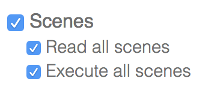

# SmartThingsShortcuts
Demo App for SwiftMN Siri Shortcuts talk

## Requirements
* A SmartThings account
* Some Scenes created in the [SmartThings Classic app](https://itunes.apple.com/us/app/smartthings-classic/id590800740)

## Set up
* Grab a [Personal Access Token](https://account.smartthings.com/tokens)
    * Check the box next to `Scenes` for Authorized Scopes  
      
* Click "generate token" then copy the token that it generates
    * Place the token in `Secret.swift`
    * find/replace `PLACE_PERSONAL_ACCESS_TOKEN_HERE` with your actual token

## SmartThings API documentation
You probably don't need this, but if you're at all interested, the public API for SmartThings is [documented here](https://smartthings.developer.samsung.com/develop/api-ref/st-api.html#tag/scenes)
